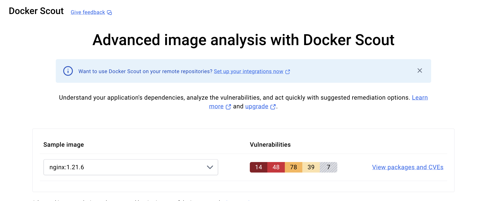
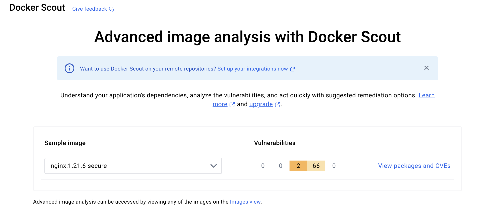

# Dockerized Copa

```bash
docker pull pradhans0906/dockerized-copa:latest
```

## Patch an image
```bash
docker run --rm --privileged \
  -v /var/run/docker.sock:/var/run/docker.sock \
  -e DOCKER_CONFIG=/root/.docker \
  pradhans0906/dockerized-copa:latest \
  "nginx:1.21.6"
```

## Key Features:
- 🔒 Simple vulnerability patching for container images
- 🐳 Fully containerized solution
- 🔄 Works seamlessly with Docker Desktop
- 🛠️ Easy-to-use command-line interface

Perfect for DevOps engineers and developers who want to keep their container images secure without disrupting their existing workflows. Built for macOS users, compatible with Docker Desktop.

## Documentation
- Usage Guide
- Development Guide
- Contributing
- Changelog

## Requirements
- Docker Desktop (macOS)
- Docker-scout (scanner) To get the CVE details.
- Internet access for pulling images

## Installation

### Using Docker Pull
```bash
docker pull pradhans0906/dockerized-copa:latest
```

### Building from Source
```bash
git clone https://github.com/pradhans0906/dockerized-copa.git
cd dockerized-copa
```

### Build Options

#### Standard Build
```bash
docker build --no-cache --build-arg copa_version=0.9.0 -t copa-local:0.9.0 .
```

#### Distroless Build (Minimal Version)
We also provide a distroless version for a more secure and lightweight container:
```bash
# Build the distroless version
docker build -t copa-distroless --build-arg copa_version=0.9.0 -f Distroless .
```

The distroless version provides:
- Smaller image size
- Reduced attack surface
- Direct binary execution
- No shell or unnecessary utilities

Using the distroless version:
```bash
docker run --rm --privileged \
    -v /var/run/docker.sock:/var/run/docker.sock \
    copa-distroless \
    -i "nginx:1.22" -t "nginx:1.22-patched" --debug
```

## Usage Examples

### Standard Version
```bash
# To patch Nginx
./scripts/patch.sh nginx:1.21.6

# Example output:
#18 sending tarball 1.0s done
#18 DONE 2.5s
time="2024-11-06T23:47:39Z" level=debug msg="stopping session"
time="2024-11-06T23:47:40Z" level=info msg="Loaded image: nginx:patched"
time="2024-11-06T23:47:40Z" level=warning msg="--debug specified, working folder at /tmp/copa-3235261740 needs to be manually cleaned up"
```

Check 'docker images' for the patched image:
```bash
docker images
REPOSITORY    TAG             IMAGE ID       CREATED         SIZE
nginx         1.21.6-patched  8945b370ac89   2 years ago     307MB
nginx         1.21.6         2bcabc23b454   2 years ago     418MB
```

### With Custom Tag
```bash
./scripts/patch.sh nginx:1.21.6 1.21.6-secure
```

```bash
REPOSITORY    TAG             IMAGE ID       CREATED         SIZE
nginx         1.21.6-secure   a87859d4a2d2   2 years ago     307MB
nginx         1.21.6         2bcabc23b454   2 years ago     418MB
```

### Version Comparison
- **Standard Version**: Full featured, includes shell capabilities
- **Distroless Version**: Minimal size, enhanced security, direct binary execution

### Vulnerability Status
Let's check the status of the Vulns.




## Contributing
We welcome contributions! Please see our Contributing Guide for details.

## License
This project is licensed under the MIT License - see the LICENSE file for details.

## Acknowledgments
- Copacetic Team for the original COPA tool
- Docker Team for Docker Scout
